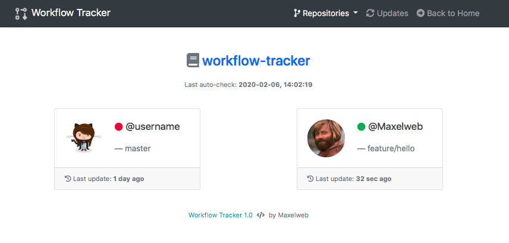

# Workflow Tracker

A simple web-hook that shows a real-time branch workflow and the online status of the contributors in a repository

### Current version

**Version:** 1.0.2

> Add Dockerfile and docker-compose configuration file. Use `docker-compose up -d` and `docker-compose down -v` to run the app through Docker.

### Description and Features

This is a simple web app developed in PHP and JS used to track real-time work of the collaborators in a public or private repo. 

- :iphone: Desktop, Tablet and [Mobile](_docs/workflow-mobile.png) view (Bootstrap)
- :bar_chart: Real-time data check (every 20 seconds)
- :call_me_hand: Github Webhook integration
- :grinning: User status and current working branch based on push events
- :page_with_curl: NO DATABASE needed, just a simple JSON file
- :open_file_folder: Multiple repositories, one single webhook to point
- :electric_plug: Ez install: deploy the webapp, change the config and point the webhook
- :raised_hand_with_fingers_splayed: Online update checker

### Requirements

- Apache based web server
- PHP 7.x
- One or more public / private Github repo.

### Installation

> **Tip:** if you download the **source code** from the release page, you can deploy the web app without these files: `.gitignore`, `LICENSE`, `README.md`, folders starting with underscore (`_folder`).

1. Download the latest release
2. Change the `res/config.php` and `.htaccess` according to your preferences
3. Insert the files of the downloaded folder in your web space
4. Point the Github Webhook of your repo to `http://your-website.com/res/webhook.php` for only **push** events.
5. Check the first `ping` - `pong` delivery from the Github Webhook page
6. Done :smile:

### Update

> **Tip:** you can check the updates from the updates page link in the navbar

1. Backup locally the `res/data` folder, the `res/config.php` and `.htaccess` files
2. Download the latest release
3. Change the `res/config.php` and `.htaccess` according to your old preferences
4. Replace the `res/data` folder with your local backup
5. Done :grin:

### Stored data

- The data is stored in the `res/data` folder via a single JSON file.
- You will see all the collaborators (after the webhook setup) with at least one push in the repo from any branch.
- The users and the repos won't be automatically deleted.

### Problems or suggestions?

Open a new issue if you have any problem or any suggestion for future updates :slightly_smiling_face:

### License and Credits

**MIT License**

Developed by [Mariano Sciacco](https://marianosciacco.it) (@Maxelweb)

Thanks for the __Github Webhook Handler__ developed by [Miloslav Hůla](https://github.com/milo)

### Support

